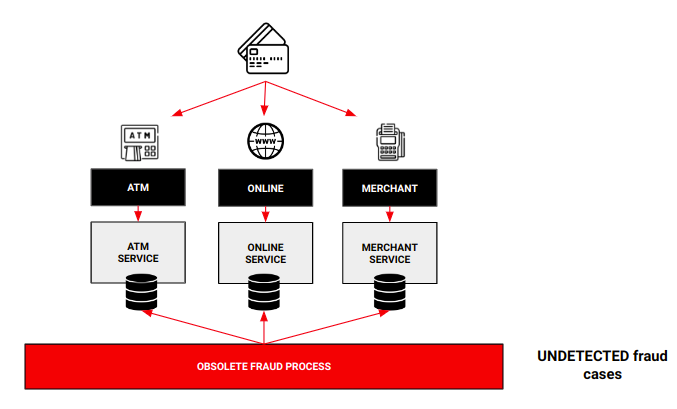
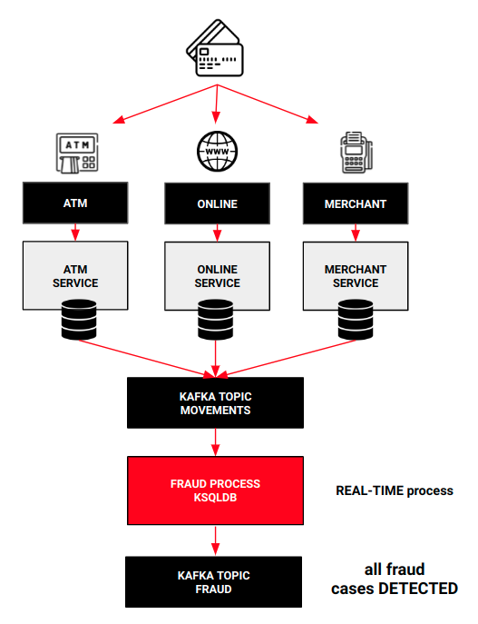
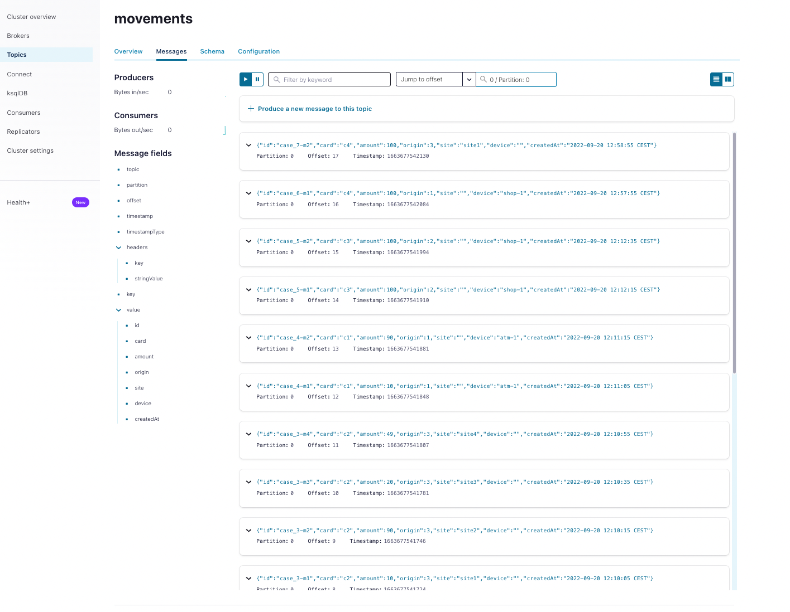
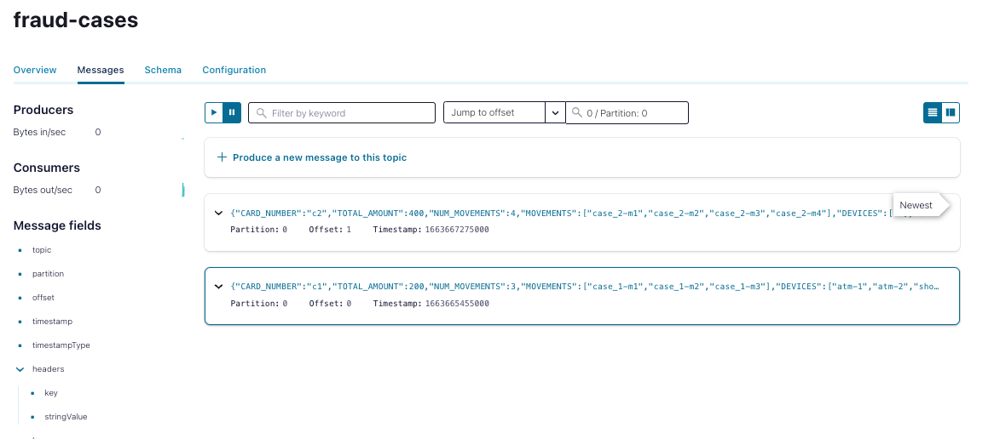

# Fraud Checker Project


This project defines how to detect fraud operations in real time for a banking organization.

For this, it uses **KsqlDB**, a technology for building data stream processing applications, where all the operations on this data flows are carried out in Kafka, taking advantage of all the benefits of this technology.

In fact, this is a part of the power of KsqlDB. If you want to learn more about it, please visit its documentation: https://ksqldb.io/ .

##### Requeriments

- Docker (to build the associated infrastructure, Confluent platform and its components)


## The use case
A banking organization is having trouble controlling fraud over card transactions because the current solution, batch based, Card movements are generated in three channels: ATM, online and merchants. Current solution gets movements from these sources several times per day and then, examines the movements in order to detect suspicious behaviour. The followin picture shows this scenario:



This solution is very inefienct because some cases are not detected and others are detected so late. Because of that, the company needs to detect potential fraud operations in real time in order to improve security, avoid problems related to this practice and maintain clients confidence. How can we solve this problem?


## The solution: streaming

In order to create a solution to detect fraud cases in real time, we have to face two key points:

- have access to all the movements in real time
- be able to examine all those movements in real time in order to detect fraudulent patterns

To achieve the first point, for instance, we could deploy a CDC tool in order to publish in real time (or near real time) every change in movements sources to an event bus like Kafka. Then, once the movements are in the event bus, to achieve the second point, we are going to use an streaming solution. In this case: KsqlDB:


> **INFO:** KsqlDB also offers a wide range of connectors that allow to send information from different sources to Kafka topics, because it's supported by Kafka Connect

We'll do learn how to analyze this stream of movements to find suspicious patterns. Once all the data is accessible and centralized in a Kafka topic, we implement a topology to detect two patterns within the stream:

- Two or more movements from different ATM or merchants within a sort period of time
- More than 4 movements from ATM or merchants within a sort period of time independently of its device (same ATM or not
- Multiple online movements exceeding a defined amount

If these patterns are detected, a fraud case is generated. That means that an event will be published in another Kafka topic (for instance, "fraud-cases") in order to make the pertinent decisions with that revealed data and confirm or not the fraudulent behaviour.




## How is structured this repo?

In this repo you'll find these folders:

- **apps**: it contains two Spring Boot applications
  - **Movements Generator:** this application exposes a Rest API to help us to publish movements to Kafka
  - **Ksqldb scripts**: contains ksqldb scripts to detect fraud cases
  - **Tester**: necessary files to test the ksqldb scripts with [ksql-test-runner](https://docs.ksqldb.io/en/latest/how-to-guides/test-an-app/) tool
- **platform**: it contains the *docker-compose* file to launch a demo environment to really understand how all the components works and fraud cases are detected. The platform is composed of:
  - Zookeeper
  - Kafka
  - Movements Generator App
  - Control Center
  - KsqlDB Server
  - Kafka Connect
  - Schema Registry
- **demo**: this folder contains the necessary scripts to execute the demo
  - *1-init.sh*: this script builds the docker images and launch the different docker containers
  - *2-generate-movements.sh*: this scripts calls to the Rest API exposes by the Movement Generator app, publishing to kafka multiple cards movements to the ksqlDB app can detect fraud cases
  - *3-stop.sh*: this scripts destroy the environment.
- **doc**: this folder only contains document assets


## Executing the demo

Executing the demo is very easy. As we've seen in the previous section, there are some scripts to help us to execute all the necessary taks.

The first step is going to demo folder because all the scripts are going to be executed from there:

```bash
cd demo
```

Once in the demo folder, we have to execute the script creating and initializing the environment. To do that, just write:

```bash
sh 1-init.sh
```

When the script ends, we'll see something like this:

```bash
[+] Running 11/11
 ⠿ Container zookeeper                Running
 ⠿ Container broker                   Healthy
 ⠿ Container connect                  Started
 ⠿ Container ksqldb-server            Started
 ⠿ Container init                     Started
 ⠿ Container schema-registry          Healthy
 ⠿ Container fraud-checker-generator  Started
 ⠿ Container ksqldb-cli               Started
 ⠿ Container control-center           Started
 ⠿ Container rest-proxy               Started
 ⠿ Container ksql-datagen             Started

Waiting for platform to be ready....
Platform ready!
Now you can execute the next script to send movements automatically to the broker or sending manually
To execute the script:
    sh 2-generate-movements.sh

```

Now, the environment is up and running. So, the next step is generating multiple movements in order to detect fraud cases:

```bash
sh 2-generate-movements.sh
```

Once the movements are published, the script will show the following links:

```bash
-------------------------------
Go to Control Center to examine topics: movements and fraud-cases
Control Center: http://localhost:9021/
-------------------------------
```

Now, if we go to the Confluent [Control Center](http://localhost:9021/) we canl check that multiple movements have been published to the topic ***movements***:



And, the most interesting part, two fraud cases have been detected by KsqlSB. If we examine the fraud-cases topic, we'll see these two cases:



Now, you already have all the tools to play with the process. **Enjoy!**

## How to destroy the environment

Finally, to destroy the environment, we simply have to run the following script:

```bash
sh 3-stop.sh
```


## Ksql-test-runner

ksql-test-runner is a ksqlDB testing tool to test set of KSQL statements without requiring any infrastructure, like Apache Kafka and KSQL clusters. 

### How to install it?

This tool is included witihin the Confluent distribution so, the easiest way to use it is downloading the Confluent package. For instance: http://packages.confluent.io/archive/7.2/confluent-7.2.1.tar.gz

> Be careful with Java version. Java 11 is recommended for this version of Confluent Platform.

Once it's downloaded, extract all the files and you'll find it in the bin folder.

We recommend you to add the bin folder to your path:

```bash
export CONFLUENT_HOME=<your path>/confluent-7.2.1
export PATH=$PATH:$CONFLUENT_HOME/bin
```


### Testing our Ksql Script

Executing the tests is easy, just write:

```bash
cd apps/tester
ksql-test-runner -s break_up_test.sql -i break_up_test_input.json -o break_up_test_output.json
```

